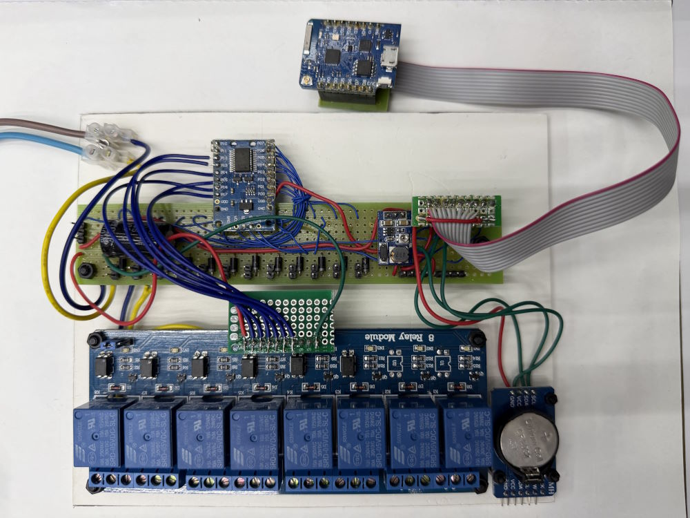
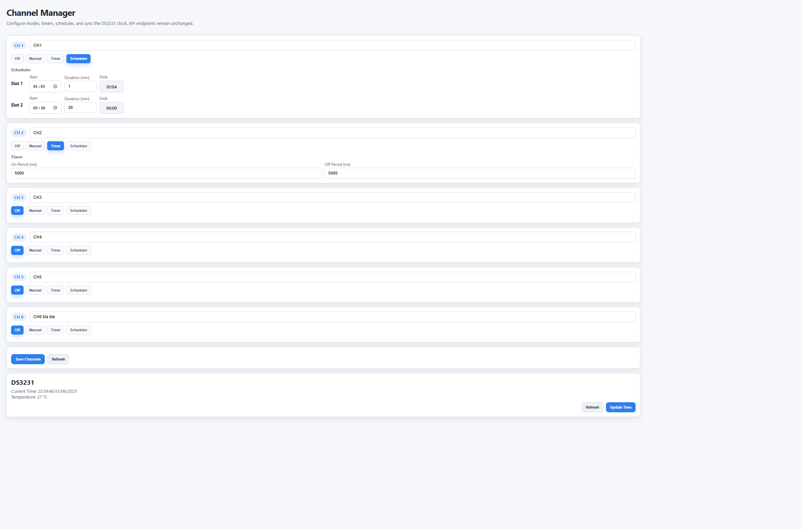

# D1 Mini Watering System Controller v2

ESP8266 (Wemos D1 mini) irrigation controller that drives six relay channels through a PCF8575 I/O expander. Each channel can run in manual, timer, or schedule mode, with settings persisted in LittleFS and a DS3231 RTC providing stable time. A built-in Vue UI and HTTP API expose configuration, OTA updates, and a simple LittleFS file manager.

## Features
- Six channels mapped to the PCF8575 (relays on pins 14/13/12/11/10/0) with per-channel mode: manual on/off, recurring timer, or up to four daily schedules.
- Automatic relay enable + main water valve handling, plus optional GPIOs reserved for water meter/sensors.
- DS3231 time read/write endpoints; schedule checks run every 20s and timers run continuously.
- Web server at `http://<device-ip>/` serving a gzipped Vue interface (`/vue.js`); JSON API stays unchanged for automation.
- OTA firmware update via the built-in updater, and LittleFS file operations (`/files`, `/upload`, `/delete`, `/file/<path>`, `/spiffsinfo`).
- Static IP helper preconfigured for `192.168.100.18`; credentials live in `include/secrets.h`.

## Hardware
- Wemos D1 mini (ESP8266)
- PCF8575 I²C expander at `0x20` (SCL `D1`, SDA `D2`)
- Six-channel relay board (driven by PCF8575 pins 14/13/12/11/10/0) plus a relay-enable pin and main water valve pin
- DS3231 RTC
- Optional: flow meter on `D5` and two soil sensors on `D6`/`D7`

### Hardware build (photo)


## Build & Flash
1. Install PlatformIO.
2. Fill `include/secrets.h` with your Wi‑Fi credentials.
3. Build & upload: `pio run -e d1_mini -t upload` (adjust `upload_port` if needed).
4. Monitor serial logs at 115200 baud: `pio device monitor`.

## Web UI assets
- The SPA and Vue runtime are embedded as headers (`src/webpage.h`, `src/vuejs.h`).
- To regenerate after editing `html/index.html` or updating Vue:
  ```
  cd html
  npm install        # first time only
  node build-vuejs.js
  node build-index.js
  ```
  Then rebuild the firmware so the new headers are flashed.

### Web UI (screenshot)



## API quick reference
- `GET /channels.json` – current channel definitions; `POST /channels.json` – update modes/schedules/timers.
- `GET /DS3231.json` – RTC time/temperature; `POST /DS3231.json` – set time.
- `GET /files` – list LittleFS files; `GET /file/<name>` – download; `GET /delete?filename=<name>` – remove; `POST /upload` – upload.
- OTA: visit `/update` (served by `ESP8266HTTPUpdateServer`).
